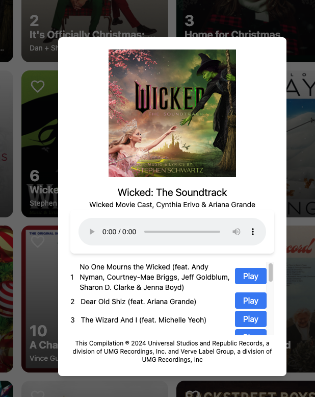
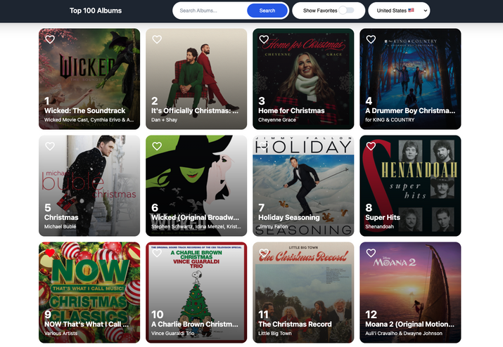
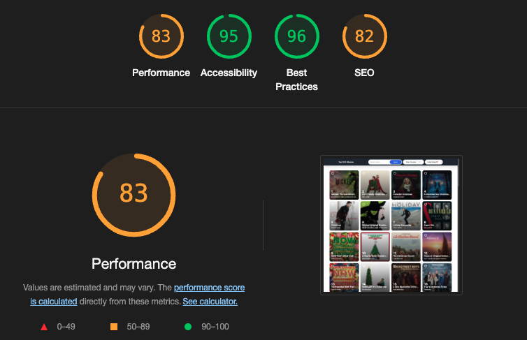

# iTunes Top 100 Albums Viewer 

This website allows users to explore the top 100 albums on iTunes for a selected country. Browse albums, listen to track previews, and customize your experience with powerful filtering and search features.

## Features 

- **Album Browsing**: View the top 100 albums for the selected country.
- **Track Previews**: Click on an album to listen to previews of its tracks.
- **Favorites**: Mark albums as favorites and filter the list to view only your favorites.
- **Search**: Search albums by title or artist for the selected country's Top 100.

## How-to 

1. **View Albums**: On the homepage, browse through the top 100 albums for the selected country.
2. **Preview Tracks**: Click on an album card to open its details and listen to previews of its tracks.
3. **Favorite Albums**:
   - Click the "Favorite" button on any album card to add it to your favorites list.
   - Use the filter option to view only your favorite albums.
4. **Search by Title or Artist**: Use the search bar to find albums based on their title or the artist's name.

## Getting Started

### Prerequisites

- Node.js 

### Installation

1. **Clone the repository:**
   ```bash
   git clone <repo-url>
2. **Navigate to the project directory:**
    ```bash
    cd Charts-top100
3. **Install packages:**
    ```bash
    npm install

5. **Run the app locally using:**
     ```bash
    npm run dev

**Album Track Preview:**



**Home Preview:**



**Lighthouse Scores:**


